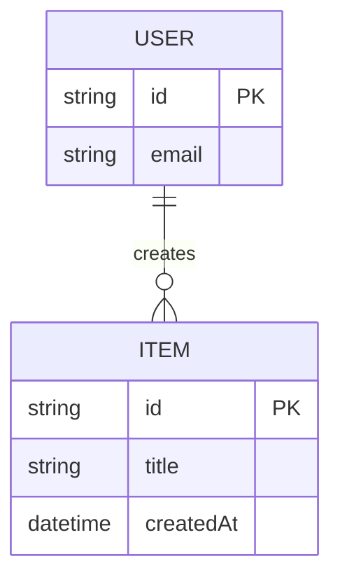
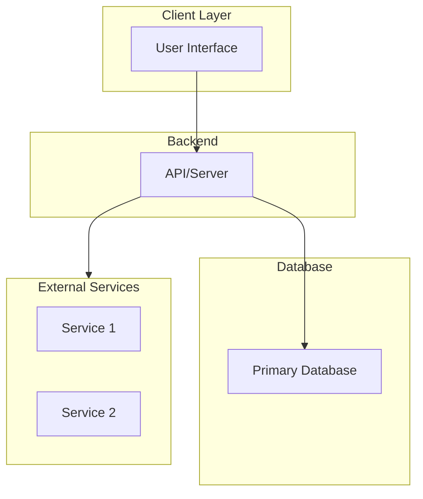

# Project Name

> Brief tagline describing your project

---

## 📋 Table of Contents

- [Problem Statement](#-problem-statement)
- [Target Users](#-target-users)
- [Features](#-features)
- [Data Architecture](#-data-architecture)
- [Tech Stack](#-tech-stack)
- [Monetization](#-monetization) *(optional)*
- [UI/UX Guidelines](#-uiux-guidelines)

---

## 🎯 Problem Statement

<!-- Describe the problem your project solves -->

<!-- Example structure:
- What's the current state?
- Why is it a problem?
- How does your project solve it?
-->

---

## 👥 Target Users

<!-- Who are the primary users of this project? -->

| User Type | Primary Needs |
| --- | --- |
| User 1 | <!-- Primary needs/use cases --> |
| User 2 | <!-- Primary needs/use cases --> |

---

## ✨ Features

### Core Features

<!-- List main features and their descriptions -->

- Feature 1
- Feature 2
- Feature 3

### Optional/Premium Features

<!-- Features that may be behind a paywall or optional -->

- Premium Feature 1
- Premium Feature 2

---

## 🗄️ Data Architecture

### Entity Relationship Diagram

<!-- Use Mermaid ERD to visualize your data model -->



### Database Schema

<!-- Document your database schema, ORM models, or data structures -->

### Key Models

- **User** - User account information
- **Item** - Core data entity
- **[Your Models]** - Describe additional key entities

---

## 🛠️ Tech Stack

### Architecture Overview



### Technology Choices

| Category | Technology | Notes |
| --- | --- | --- |
| **Framework** | <!-- e.g., Next.js, Django, Spring Boot --> | <!-- Rationale --> |
| **Language** | <!-- e.g., TypeScript, Python, Go --> | <!-- Rationale --> |
| **Database** | <!-- e.g., PostgreSQL, MongoDB --> | <!-- Rationale --> |
| **ORM/Query** | <!-- e.g., Prisma, SQLAlchemy --> | <!-- Rationale --> |
| **Auth** | <!-- e.g., NextAuth, Auth0 --> | <!-- Rationale --> |
| **Styling** | <!-- e.g., Tailwind CSS, CSS Modules --> | <!-- Rationale --> |

### Important Development Notes

> Add any critical notes or warnings about development setup, migrations, deployments, etc.

### Recommended Links

- [Technology 1 Docs](https://example.com)
- [Technology 2 Docs](https://example.com)

---

## 💰 Monetization

*Optional section — remove if not applicable*

### Pricing Tiers

<!-- Define your pricing model, if any -->

| Feature | Free | Pro |
| --- | :--: | :--: |
| Feature 1 | ✅ | ✅ |
| Premium Feature 1 | ❌ | ✅ |
| Premium Feature 2 | ❌ | ✅ |

---

## 🎨 UI/UX Guidelines

### Design Principles

- **Principle 1** - Description
- **Principle 2** - Description
- **Principle 3** - Description

### Design References

<!-- Link to inspiration or competitor design patterns -->

- [Reference 1](https://example.com)
- [Reference 2](https://example.com)

### Layout Structure

<!-- ASCII art or description of main layout -->

```
┌─────────────────────────────────────────┐
│  Header                                 │
├─────────────────┬───────────────────────┤
│   Sidebar       │   Main Content        │
│                 │                       │
│                 │                       │
└─────────────────┴───────────────────────┘
```

### Color Palette

<!-- Define your color scheme -->

```css
:root {
  --primary: #0000ff;
  --secondary: #666666;
  --success: #00aa00;
  --error: #ff0000;
  --background: #ffffff;
  --text: #000000;
}
```

### Responsive Behavior

| Viewport | Behavior |
| --- | --- |
| Mobile (<768px) | <!-- Mobile layout description --> |
| Tablet (768-1024px) | <!-- Tablet layout description --> |
| Desktop (>1024px) | <!-- Desktop layout description --> |

### Micro-interactions

- **Transitions** - <!-- e.g., Smooth 200ms easing --> 
- **Hover States** - <!-- e.g., Subtle elevation on cards -->
- **Loading States** - <!-- e.g., Skeleton placeholders -->
- **Feedback** - <!-- e.g., Toast notifications -->

---

## 📁 Project Structure

```
project-root/
├── src/
│   ├── components/
│   ├── pages/ or routes/
│   ├── lib/ or utils/
│   ├── styles/
│   ├── types/
│   └── hooks/ (if applicable)
├── tests/
├── docs/
├── public/
├── .env.example
├── package.json
└── README.md
```

---

## 🚀 Next Steps

- [ ] Define problem statement and target users
- [ ] Finalize feature list
- [ ] Choose and document tech stack
- [ ] Design database schema
- [ ] Create initial project structure
- [ ] Implement core features
- [ ] Add testing
- [ ] Deploy

---

*Last updated: [DATE]*
